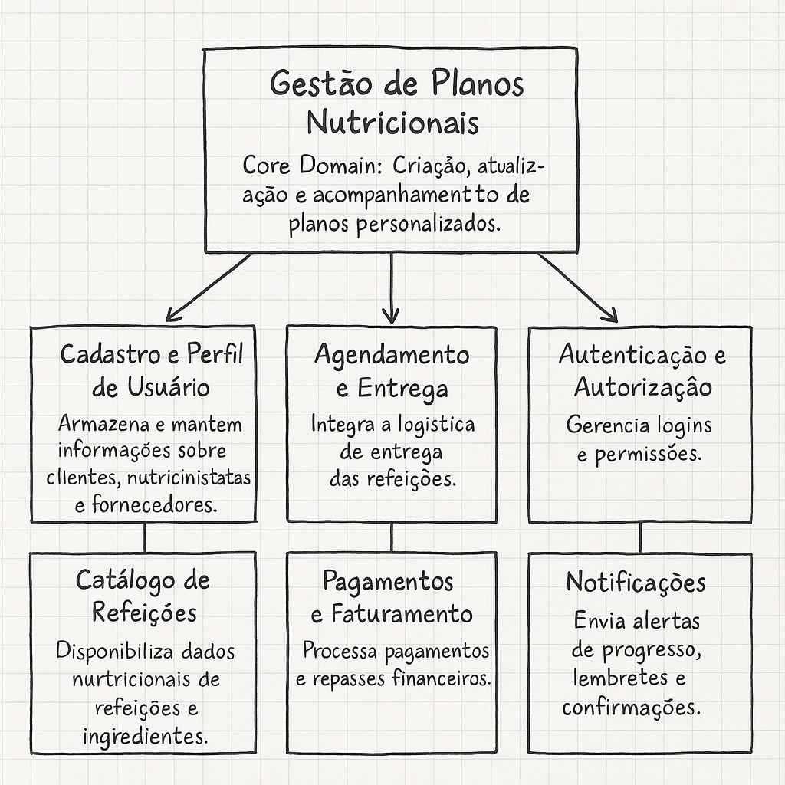
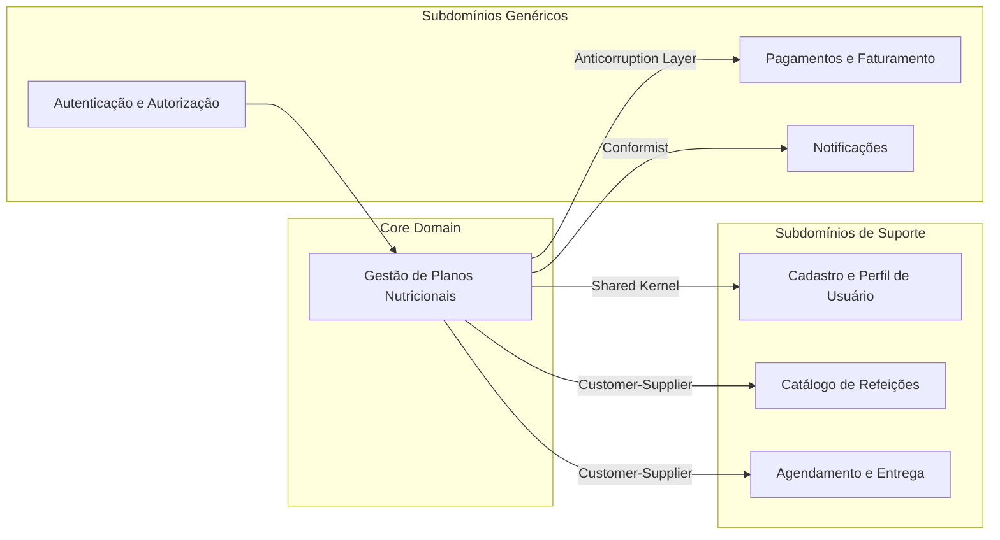
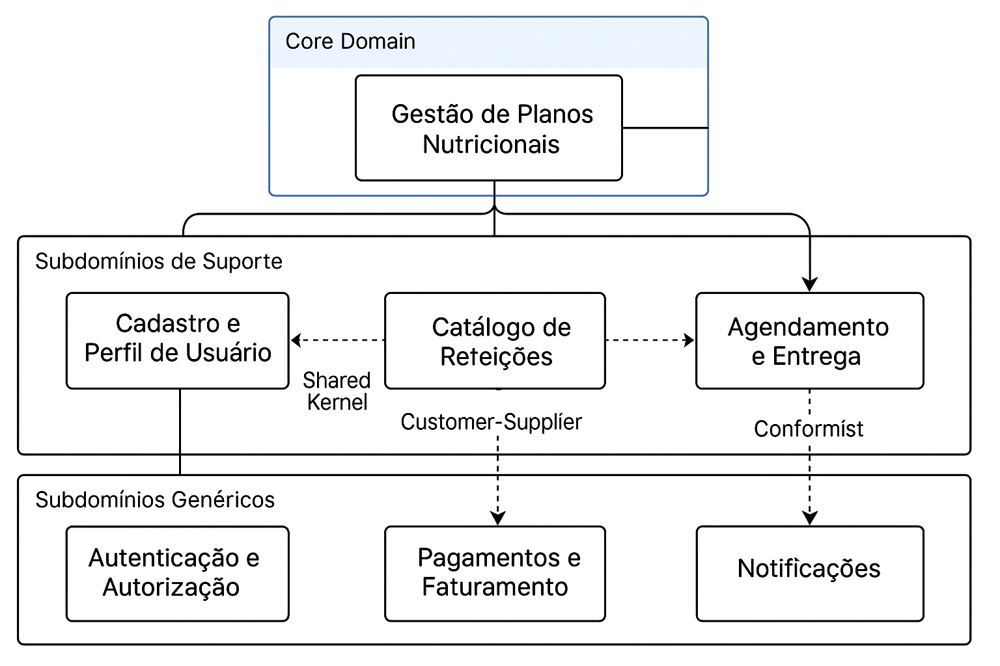
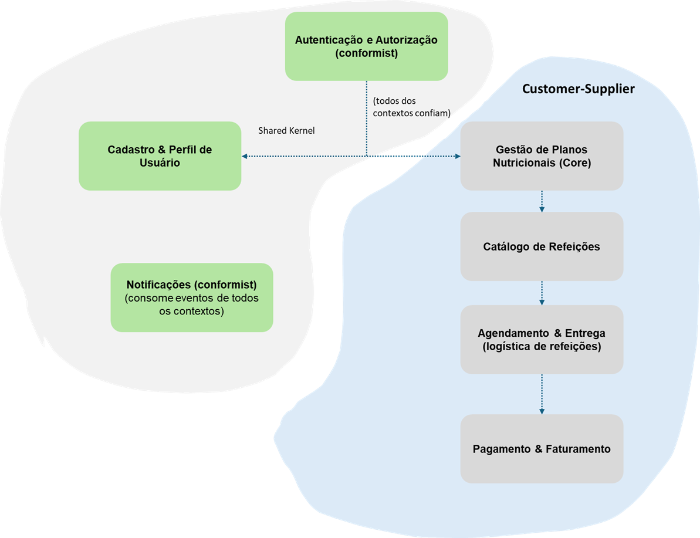
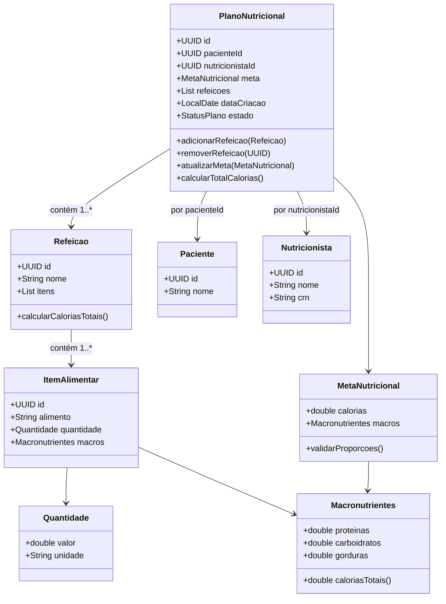

📚 Domain-Driven Design - Aula 1 —   Design Estratégico do Projeto
---

# 👥 1. Equipe
| **RM**   | **Nome**                  |
|----------|---------------------------|
| RM362208 | Adriano Rabello           |
| RM365052 | Francielli Manchini Tateo |
| RM364993 | Fábio Ivo Silva           |
| RM365124 | Renato Magri Trevine      |

---

## 🎯 Objetivo
Identificar os **subdomínios** do projeto, classificá-los como **Core, Supporting ou Generic**, e desenhar os **Bounded Contexts** que delimitam responsabilidades e interações.  
Este exercício tem como meta construir uma **visão estratégica e de alto nível** do domínio, preparando o terreno para o **Design Tático**.


## 🏷️ 1. Nome do Projeto
**Magraz — Plataforma Inteligente de Gestão e Personalização de Dietas Saudáveis**

---

## 💡 2. Objetivo Principal do Projeto

Desenvolver uma **plataforma digital integrada** que conecte **nutricionistas**, **fornecedores de refeições saudáveis** e **clientes finais**, permitindo a criação de **planos nutricionais personalizados** e o acompanhamento contínuo do progresso.  
O sistema busca **promover hábitos alimentares saudáveis**, **reduzir o tempo de planejamento** e **aumentar a adesão às dietas** por meio de automação e inteligência de dados.

---

### 🚀 Fase 1 — Conexão e Gestão de Planos Nutricionais
Implantar a base da plataforma, permitindo que nutricionistas criem e gerenciem **planos personalizados**, integrando-se com fornecedores de refeições.
> 🎯 **Foco:** funcionalidade central e comunicação eficiente entre todos os participantes.

### 🧠 Fase 2 — Inteligência e Otimização em Tempo Real
Evoluir para um sistema **inteligente e adaptativo**, que recomenda e ajusta automaticamente os planos com base nas **métricas de saúde e preferências do cliente**.
> 🎯 **Foco:** automação, engajamento e otimização contínua.

---

## 🧩 3. Identificação e Classificação dos Subdomínios

| **Subdomínio**                    | **Descrição**                                                        | **Tipo**              |
|----------------------------------|---------------------------------------------------------------------|-----------------------|
| **Gestão de Planos Nutricionais** | Criação, personalização e acompanhamento de dietas e metas.         | 🟢 **Core Domain** |
| **Cadastro e Perfil de Usuário**  | Gerencia dados de clientes, nutricionistas e fornecedores.          | 🟡 **Supporting** |
| **Catálogo de Refeições**         | Mantém cardápios, ingredientes e valores nutricionais.              | 🟡 **Supporting** |
| **Agendamento e Entrega**         | Integração logística para entrega de refeições ao cliente.          | 🟡 **Supporting** |
| **Autenticação e Autorização**    | Controle de login, permissões e segurança.                          | ⚪ **Generic** |
| **Pagamentos e Faturamento**      | Integração com gateways de pagamento e gestão financeira.           | ⚪ **Generic** |
| **Notificações**                  | Envio de e-mails, push e SMS para interação e engajamento.          | ⚪ **Generic** |

## 📝 Justificativa da Estrutura de Domínios

A divisão dos domínios da plataforma foi pensada para garantir que o **foco estratégico** permaneça no que realmente diferencia o produto no mercado, ao mesmo tempo em que **domínios de suporte e genéricos** oferecem a base necessária para operação e escalabilidade.

---

### 🎯 Domínio Principal (Core Domain)

1. **Gestão de Planos Nutricionais**  
   Este é o coração da plataforma, responsável pela **personalização e acompanhamento de dietas**.
    - Ele concentra a inteligência do negócio, pois conecta dados de clientes, métricas de saúde e preferências alimentares em **planos nutricionais personalizados**.
    - O diferencial competitivo da solução está exatamente aqui: permitir que nutricionistas criem planos dinâmicos, ajustados em tempo real com base na evolução do cliente.
    - Por isso, este domínio é considerado **Core Domain**, já que sustenta a proposta de valor do produto e não pode ser delegado ou simplificado.

---

### 🔧 Subdomínios de Suporte

2. **Cadastro e Perfil de Usuário**
    - Necessário para gerenciar clientes, nutricionistas e fornecedores, garantindo que a plataforma saiba **quem são os atores envolvidos**.
    - Embora fundamental para o funcionamento, não representa vantagem competitiva direta, por isso é de suporte.

3. **Catálogo de Refeições**
    - Serve como insumo para a criação de planos, armazenando informações de cardápios, ingredientes e valores nutricionais.
    - Apoia o Core Domain, mas pode ser adaptado ou até terceirizado no futuro, caso haja integração com bancos de dados externos de nutrição.

4. **Agendamento e Entrega**
    - Permite a integração logística para levar refeições até o cliente.
    - Essencial para a experiência completa, mas de suporte, pois a inteligência de negócio está no **plano nutricional** e não na logística em si.

---

### ⚙️ Subdomínios Genéricos

5. **Autenticação e Autorização**
    - Controle de login e permissões de acesso.
    - É uma necessidade comum em qualquer sistema, sem especificidade de negócio, podendo ser implementado com soluções prontas (ex.: Keycloak, Auth0).

6. **Pagamento e Faturamento**
    - Garantia de monetização e integração com gateways de pagamento.
    - Fundamental para viabilidade financeira, mas genérico, pois não é exclusivo da área de nutrição.

7. **Notificações**
    - Canal de comunicação para alertas, lembretes e acompanhamento do usuário.
    - Apesar de aumentar engajamento, não representa um diferencial estratégico, já que pode ser implementado com serviços externos (ex.: Firebase, Twilio).


| **Origem (Contexto)**                           | **Destino (Contexto)**           | **Tipo de Relacionamento**         | **Explicação / Justificativa**                                                                                                                                                                                 |
| ----------------------------------------------- | -------------------------------- | ---------------------------------- | -------------------------------------------------------------------------------------------------------------------------------------------------------------------------------------------------------------- |
| **Gestão de Planos Nutricionais (Core Domain)** | **Cadastro e Perfil de Usuário** | 🧩 **Shared Kernel**               | Ambos compartilham entidades essenciais como **Paciente** e **Nutricionista**, garantindo consistência em dados básicos (nome, idade, CRN, objetivos). As alterações nesses dados refletem nos dois contextos. |
| **Gestão de Planos Nutricionais**               | **Catálogo de Refeições**        | 🔁 **Customer–Supplier**           | O **Core Domain** consome informações do **Catálogo de Refeições**, utilizando cardápios e valores nutricionais para compor os planos alimentares.                                                             |
| **Gestão de Planos Nutricionais**               | **Agendamento e Entrega**        | 🔁 **Customer–Supplier**           | O **plano nutricional** gera a demanda de refeições que alimenta o contexto de **Entrega**, responsável por coordenar horários e logística de envio.                                                           |
| **Gestão de Planos Nutricionais**               | **Pagamentos e Faturamento**     | 🧱 **Anti-Corruption Layer (ACL)** | O domínio protege seu modelo interno das variações e complexidade de **gateways de pagamento**, traduzindo apenas as informações financeiras relevantes.                                                       |
| **Gestão de Planos Nutricionais**               | **Notificações**                 | 📣 **Conformist**                  | O contexto de **Notificações** consome eventos como *PlanoCriado*, *MetaAtingida* e *PlanoFinalizado*, apenas enviando mensagens sem afetar o domínio principal.                                               |
| **Autenticação e Autorização**                  | **Todos os Contextos**           | 🔒 **Conformist**                  | Todos os contextos confiam e seguem as regras do serviço de autenticação, sem modificar seu comportamento. Atua como um serviço genérico e transversal.                                                        |


---
## ✅ Conclusão

- O  **Core Domain** foca no que é **estratégico e insubstituível**: a **Gestão de Planos Nutricionais**.
- Os **Subdomínios de Suporte** viabilizam o negócio, mas não são diferenciais competitivos, podendo ser adaptados ou otimizados conforme a evolução da plataforma.
- Os **Subdomínios Genéricos** oferecem **infraestrutura básica** e podem até ser terceirizados ou substituídos por soluções de mercado, mantendo o time concentrado naquilo que gera valor exclusivo.

Essa separação garante **clareza arquitetural, foco no diferencial de mercado e flexibilidade de evolução**.


---

## 🧭 4. Desenho dos Bounded Contexts

| **Bounded Context**                | **Responsabilidade**                                                         | **Subdomínios Relacionados**   |
|------------------------------------|------------------------------------------------------------------------------|--------------------------------|
| **Gestão de Planos Nutricionais**  | Core Domain: Criação, atualização e acompanhamento de planos personalizados. | Gestão de Planos Nutricionais  |
| **Cadastro e Perfil de Usuário**   | Armazena e mantém informações sobre clientes, nutricionistas e fornecedores. | Cadastro e Perfil              |
| **Catálogo de Refeições**          | Disponibiliza dados nutricionais de refeições e ingredientes.                | Catálogo                       |
| **Agendamento e Entrega**          | Integra a logística de entrega das refeições.                                | Entregas                       |
| **Pagamentos e Faturamento**       | Processa pagamentos e repasses financeiros.                                  | Pagamentos                     |
| **Autenticação e Autorização**     | Gerencia logins e permissões.                                                | Autenticação                   |
| **Notificações**                   | Envia alertas de progresso, lembretes e confirmações.                        | Notificações                   |




---

## 🔄 5. Comunicação entre os Bounded Contexts

A interação entre os contextos segue dois padrões principais:

- **Mensageria (Assíncrono):** Comunicação desacoplada por meio de eventos de domínio.  
  Exemplo: O contexto de **Gestão de Planos Nutricionais** emite um evento `PlanoNutricionalFinalizado`, consumido por **Notificações** e **Pagamentos**.

- **APIs (Síncrono):** Comunicação direta via REST/GraphQL para operações que exigem resposta imediata.  
  Exemplo: O **Catálogo de Refeições** fornece dados nutricionais ao contexto de **Gestão de Planos**.

| **Origem (De)** | **Destino (Para)** | **Forma de Comunicação** | **Exemplo de Interação** |
|-----------------|--------------------|---------------------------|---------------------------|
| Gestão de Planos Nutricionais | Notificações | Evento (Assíncrono) | `PlanoNutricionalCriado` → gera notificação de boas-vindas. |
| Gestão de Planos Nutricionais | Pagamentos | Evento (Assíncrono) | `PlanoNutricionalFinalizado` → aciona cobrança automática. |
| Catálogo de Refeições | Gestão de Planos Nutricionais | API (Síncrono) | Consulta nutricional de ingredientes e refeições. |
| Cadastro e Perfil de Usuário | Gestão de Planos Nutricionais | API (Síncrono) | Obtenção de dados do paciente e nutricionista. |

---

## 🗣️ 6. Definição da Linguagem Ubíqua

| **Termo**               | **Descrição**                                                    |
|-------------------------|------------------------------------------------------------------|
| **Plano Nutricional**   | Conjunto de refeições e metas ajustadas ao perfil do cliente.    |
| **Refeição**            | Preparação alimentar cadastrada com seus valores nutricionais.   |
| **Meta Nutricional**    | Objetivo calórico e nutricional determinado pelo nutricionista.  |
| **Nutricionista**       | Profissional responsável pela criação e acompanhamento do plano. |
| **Cliente (Paciente)**  | Usuário que segue o plano e registra seu progresso.              |
| **Fornecedor**          | Parceiro que fornece refeições ou ingredientes.                  |
| **Entregador**          | Responsável pela logística de entrega das refeições.             |
| **Dashboard**           | Painel que exibe métricas, progresso e recomendações.            |

> A **linguagem ubíqua** garante que termos técnicos e de negócio sejam consistentes entre equipes de desenvolvimento, nutricionistas e gestores.

---

## 🧱 7. Estratégia de Desenvolvimento por Tipo de Subdomínio

| **Subdomínio**                                | **Abordagem de Implementação**                          | **Ferramentas / Tecnologias**                         |
|-----------------------------------------------|---------------------------------------------------------|-------------------------------------------------------|
| **Gestão de Planos Nutricionais (Core)**      | Desenvolvimento interno com foco total.                 | Spring Boot, Kotlin/Java, RabbitMQ/Kafka, PostgreSQL. |
| **Cadastro e Perfil de Usuário (Supporting)** | Interno com possíveis integrações externas.             | Keycloak, Auth0, PostgreSQL.                          |
| **Catálogo de Refeições (Supporting)**        | Interno com opção de integração futura a APIs públicas. | REST API, MongoDB, NutriData API.                     |
| **Agendamento e Entrega (Supporting)**        | Integração com sistemas de terceiros (logística).       | Uber Eats API, Entrega Fácil API.                     |
| **Pagamentos e Faturamento (Generic)**        | Terceirizado via APIs externas.                         | Stripe, Pagar.me, Mercado Pago.                       |
| **Autenticação e Autorização (Generic)**      | Uso de soluções prontas de identidade.                  | Auth0, Keycloak, OAuth2.                              |
| **Notificações (Generic)**                    | Integrado via mensageria ou serviços externos.          | Firebase, Twilio, AWS SNS.                            |

---

## 🧭 8. Diagrama de Contextos

> O diagrama abaixo representa os **Bounded Contexts** e suas **relações** com base nos padrões de integração do DDD (Customer-Supplier, Shared Kernel).






---
# 📚 Domain-Driven Design - Aula 2 -  Mapeamento de Contextos

- **Gestão de Planos Nutricionais ↔ Cadastro e Perfil de Usuário**
    - **Shared Kernel**: ambos compartilham informações essenciais do **Cliente** (idade, peso, objetivos) e do **Nutricionista**.

- **Gestão de Planos Nutricionais ↔ Catálogo de Refeições**
    - **Customer-Supplier**: o Core Domain consome dados do Catálogo para montar planos alimentares.

- **Gestão de Planos Nutricionais ↔ Agendamento e Entrega**
    - **Customer-Supplier**: o plano nutricional gera a demanda de refeições que alimenta a logística de entrega.

- **Pagamento e Faturamento ↔ Core Domain / Agendamento**
    - **Anti-Corruption Layer (ACL)**: protege o domínio interno da complexidade e inconsistência dos gateways de pagamento externos.

- **Autenticação e Autorização ↔ Todos os Contextos**
    - **Conformist**: todos os contextos confiam e seguem as regras de autenticação, sem adaptá-las.

- **Notificações ↔ Todos os Contextos**
    - **Conformist**: recebe eventos e envia mensagens, mas não influencia a lógica de negócio.




# 📚 Domain-Driven Design - Aula 3 - Design Tático no DDD

## 🩺 1) Sobre o Domínio Escolhido
**Nome do domínio:** **Plano nutricional**  
**Objetivo do sistema:** **Sistema de gerenciamento de planos nutricionais**  
**Principais atores:** **Clientes,nutricionista**  
**Contextos (opcional):** **Customer-Supplier, Healthcare**

---

## 🧩 2) Entidades vs Value Objects
Preencha a tabela justificando cada tipo (identidade vs. imutabilidade).

| Elemento                 | Tipo (Entidade/VO) | Por quê? (identidade/imutável)                                                                                                                                |
|--------------------------|--------------------|---------------------------------------------------------------------------------------------------------------------------------------------------------------|
| **Plano Nutricional**    | Entidade (ROOT)    | Deve possuir identificação única para gestão do seu ciclo de vida.                                                                                            |
| **Paciente**             | Entidade           | Deve possuir identificação única para cada cliente ao lonho do tempo.                                                                                         |
| **Nutricionista**        | Entidade           | Deve possuir identificação única como CRN ou  ID do sistema para identificação do nutricionista.                                                              |
| **Refeição**             | Entidade           | Cada refeição do plano tem uma identidade própria.                                                                                                            |
| **Itens de alimentação** | Entidade           | Precisa de rastreabilidade (exemplo: saber qual item foi trocado)                                                                                             |
| **Meta nutricional**     | VO                 | Representa uma meta calculada. É uma característica do plano, não uma entidade independente. (exemplo: Calorias a serem perdidas por semana.)                 |
| **Macro nutrientes**     | VO                 | Define a composição nutricional. Não faz sentido “atualizar” macros — se os valores mudam, é outro conjunto. (exemplo: proteína carboudratos, gorduras, etc.) |
| **Quantidade**           | VO                 | É definido apenas por valor e unidade. Não há entidade. É imutável.                                                                                           |


---

## 🏗️ 3) Agregados e Aggregate Root (AR)
**Agregado Principal:** **Plano Nutricional**  
**AR:** **Plano Nutricional**  
**Conteúdo interno do agregado (apenas o necessário para consistência local):**  
- **Paciente**
- **Refeição**
- **Item alimentar**
- **Meta nutricional**
- **Macro nutrientes**
- **Quantidade**


**Referências a outros agregados (por ID):**  
- **idNutricionista**
- **idPaciente**

**Boundary — Por que cada item está dentro/fora?**  

| Elemento             | Dentro/Fora | Por que cada item está dentro/fora?                                                                                             | Regra                                                                                            |
|----------------------|-------------|---------------------------------------------------------------------------------------------------------------------------------|--------------------------------------------------------------------------------------------------|
| **Refeição**         | Dentro      | Cada refeição pertence unicamente a um plano alimentar.                                                                         | Toda refeição deve ter pelo menos um item alimentar.                                             |
| **Item Alimentar**   | Dentro      | Cada item alimentar é filho da refeição e só existe dentro dela                                                                | Um item alimentar não pode ter quantidade negativa ou alimento nulo                              |
| **Meta nutricional** | Dentro      | É uma caracterisca do plano - faz parte da sua definição e ciclo de vida.                                                       | A soma das calorias de refeições deve estar dentro da meta nutricional diária                    |
| **Macro nutrientes** | Dentro      | É um atributo de composição nutricional do itens alimentares.Serve de base para cálculo de meta trucional.                      | As calorias totais do item = proteínas * 4 + carboidratos + gorduras * 9.                        |
| **Quantidade**       | Dentro      | Define a porção de um item alimentar.                                                                                           | Cada item alimentar deve ter uma quantidade positiva > 0.                                        |
| **Paciente**         | Fora        | O paciente tem ciclo de vida independente: Pode existir sem ter uma plano alimentar, e pode ter vários planos ao longo do tempo. | Uma plano alimentar deve estar associado a um paciente válido                                    |
| **Nutricionista**    | Fora        | O nutricionista tem im ciclo de vida próprio (cadastro, permissões, registro profissional)                                      | Assim como o paciente, fica fora para manter o limite claro entre agregados e baixo acoplamento  |
- **Dentro porque [precisa de consistência transacional por causa da invariante X]**  
- **Fora porque [pode esperar/eventual; pertence a outro BC; só precisa de referência por ID]**
---

## 🧭 4) Invariantes e Máquina de Estados
Liste invariantes (devem ser verdadeiras ao final de cada transação).
**Invariantes (exemplos):**
- **[Não aceitar pagamento acima do limite de crédito]**
- **[Não permitir slot de horário sobreposto para o mesmo recurso]**
- **[Não permitir alteração após estado X]**
- **[Preço Total = soma dos itens] (se aplicável)**

| Nome da invariante                                           | Descrição / Regra                                                                       | Elementos envolvidos                           | Tipo d verificação      | Deve ser verdadeira quando...                | Observação |
|--------------------------------------------------------------|-----------------------------------------------------------------------------------------|------------------------------------------------|-------------------------|----------------------------------------------|------------|
| **Plano deve estar associado a um paciente**                 | Todo plano deve ter referência a um paciente existente e atibo no sistema.              | Plano nutricional / Paciente                   | Referencial             | Ao criar ou atualizar o plano                |            |
| **Nutricionista deve estar ativo**                           | Apenas nutricionistas ativos podem criar ou alterar planos nutricionais.                | Plano nutricional / Nutricionista              | Regra de domínio        | Ao criar o plano                             |            |
| **Refeição deve contar ao menos um item alimentar**          | Nenhuma refeição pode ser salva sem conter pelo menos um alimento.                      | Refeição / item alimentar                      | Estrutural              | Ao adicionar ou persistir refeição           |            |
| **Item alimentar deve possuir quantidade positiva**          | A quantidade de cada item alimentar deve ser maior que zero.                            | Item Alimentar / Quantidade                    | Valor mínimo            | Ao criar ou atualizar o item                 |            |
| **Plano não pode ser alterado após finalização**             | Uma vez finalizado, o plano se torna imutável.                                          | Plano Alimentar                                | Estado                  | Após o estado ser “Finalizado”               |            |
| **Paciente não pode ter dois planos ativos simultaneamente** | Um mesmo paciente só pode ter um plano alimentar “Ativo” por vez.                       | Plano Alimentar / Paciente                     | Regra de negócio global | Ao criar ou ativar um novo plano             |            |
| **Total calórico das refeições ≤ meta nutricional**          | A soma das calorias de todas as refeições não pode ultrapassar a meta diária definida.  | Plano Alimentar / Meta Nutricional / Refeição  | Consitência de negócio  | Ao adicionar, remover ou atualizar refeições |            |


---

##  Estados possíveis do Plano Nutricional (Máquina de Estados)

| **Estado**     | **Descrição**                                              | **Transições Válidas**       | **Regras de Transição**                                |
|----------------|------------------------------------------------------------|------------------------------|--------------------------------------------------------|
| **Rascunho**   | Plano em construção, ainda não publicado.                  | → *Em Análise* / *Cancelado* | Pode editar refeições, metas e itens.                  |
| **Em Análise** | Plano enviado para validação do nutricionista.             | → *Ativo* / *Cancelado*      | Nenhuma modificação estrutural permitida.              |
| **Ativo**      | Plano validado e em execução pelo paciente.                | → *Finalizado* / *Cancelado* | Pode registrar progresso, mas não alterar estrutura.   |
| **Finalizado** | Plano encerrado após o período de validade.                | —                            | Estado final, plano imutável.                          |
| **Cancelado**  | Plano anulado por decisão do nutricionista ou paciente.    | —                            | Estado final, sem operações permitidas.                |


## 🗃️ 5) Repositório do Agregado (interface)
> Repositório trabalha **apenas com a AR**, sem expor entidades internas do agregado. Consultas analíticas ficam fora (read models).

**Linguagem livre** (ex.: C#, Java, Kotlin, TS). Exemplo (C# assíncrono, adapte nomes):
```java
package com.alfa.nutre.domain.plano;

import java.util.*;

public interface PlanoNutricionalRepository {

    /**
     * Persiste ou atualiza um plano nutricional.
     *
     * @param plano O agregado do plano nutricional a ser salvo.
     */
    void salvar(PlanoNutricional plano);

    /**
     * Busca um plano nutricional pelo seu identificador único.
     *
     * @param id Identificador do plano.
     * @return O plano encontrado ou vazio se não existir.
     */
    Optional<PlanoNutricional> buscarPorId(UUID id);

    /**
     * Busca todos os planos nutricionais de um paciente específico.
     *
     * @param idPaciente Identificador do paciente.
     * @return Lista de planos nutricionais associados ao paciente.
     */
    List<PlanoNutricional> buscarPorPaciente(UUID idPaciente);

    /**
     * Remove um plano nutricional do repositório.
     *
     * @param id Identificador do plano a ser removido.
     */
    void remover(UUID id);
}
```


---

## 📣 6) Eventos de Domínio
Defina **2–4 eventos** com **payload mínimo** e **momento de publicação** (preferir **pós-commit**). Diferencie **evento interno** vs **evento de integração**.


---

| **Evento**                     | **Quando ocorre**                                                        | **Payload mínimo** | **Interno/Integração** | **Observações** |
|--------------------------------|--------------------------------------------------------------------------|---------------------|-------------------------|-----------------|
| **PlanoNutricionalCriado**     | Após o nutricionista criar e salvar um novo plano para o paciente.       | `idPlano`, `idPaciente`, `idNutricionista`, `dataCriacao` | **Integração** | Usado por módulos de notificação e relatórios. Publicado pós-commit. |
| **RefeicaoAdicionadaAoPlano**  | Quando uma nova refeição é adicionada com sucesso ao plano.              | `idPlano`, `idRefeicao`, `nomeRefeicao`, `totalCalorias` | **Interno** | Pode acionar recalculo automático da meta ou atualização da visão de resumo do plano. |
| **MetaNutricionalAtingida**    | Quando o paciente atinge a meta nutricional diária ou semanal.           | `idPlano`, `idPaciente`, `dataEvento`, `percentualAtingido` | **Integração** | Enviado ao sistema de notificações (ex: e-mail ou app) e BI de desempenho. |
| **PlanoNutricionalFinalizado** | Quando o plano é encerrado pelo nutricionista ou expira automaticamente. | `idPlano`, `idPaciente`, `dataFinalizacao` | **Interno** | Aciona bloqueio de edições e atualiza status no domínio. Publicado pós-commit. |


## ⚙️ 7) Serviços de Domínio

Os **Serviços de Domínio** representam operações do negócio que **não pertencem a nenhuma entidade específica**,  
mas que utilizam várias delas para realizar uma ação significativa.

| Serviço                              | Responsabilidade                                                                         | Entrada                          | Saída                        | Observações                                                                     |
|--------------------------------------|------------------------------------------------------------------------------------------|----------------------------------|------------------------------|--------------------------------------------------------------------------------- 
| **GeradorDePlanoService**            | Gera automaticamente um novo plano nutricional com base no perfil e metas do paciente.   | `idPaciente`, `ObjetivoPaciente` | `PlanoNutricional`           | Usa informações de histórico e taxa metabólica para sugerir refeições iniciais. |
| **RecalculadorDeMetaService**        | Recalcula a meta nutricional quando novas refeições são adicionadas ou removidas.        | `PlanoNutricional`               | `MetaNutricional atualizada` | Mantém consistência da meta com base na soma calórica total.                    |
| **NotificadorDeMetaAtingidaService** | Envia notificação quando o paciente atinge a meta nutricional semanal.                   | `MetaNutricionalAtingidaEvent`   | —                            | Consumidor de evento de integração.                                             |

---

### 🔄 Consistência entre Agregados
A consistência entre **PlanoNutricional**, **Paciente** e **Nutricionista** é **eventual**,  
garantida através da publicação dos **eventos de domínio** (ex: `PlanoNutricionalCriado`, `PlanoNutricionalFinalizado`).

Os outros contextos (ex: cadastro de pacientes, gestão de profissionais) **reagem a esses eventos**,  
atualizando seus próprios estados **de forma assíncrona**.


## 🗺️ 8) Diagrama Mermaid
> Mostre **Agregados/AR**, **VOs** e **relacionamentos por ID** entre agregados (não “contenha” outros agregados).

**Exemplo de esqueleto Mermaid:**

