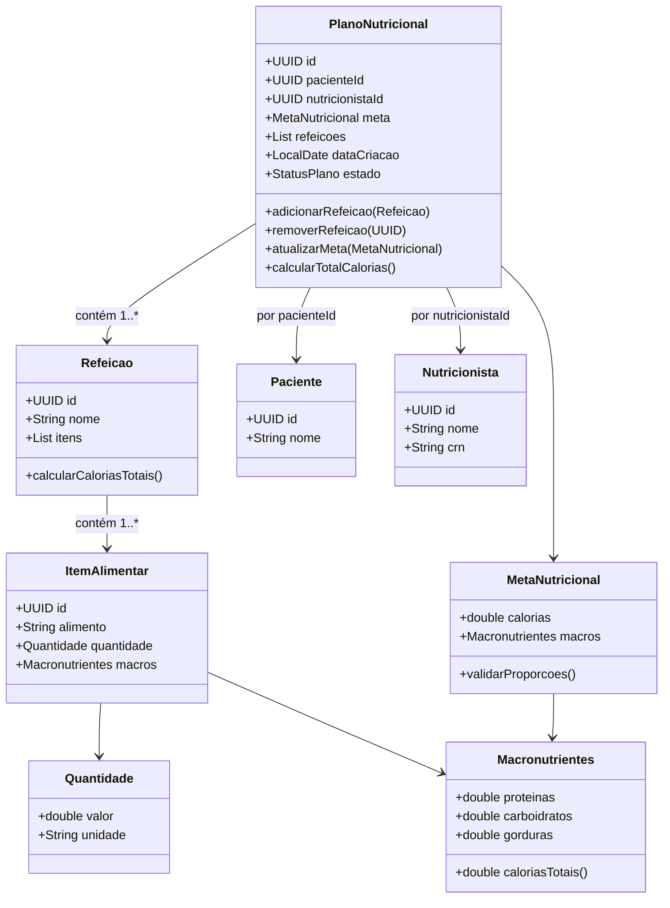

# 📚 Diciplina Domain Driven Design — Design Tático no DDD

## 🩺 1) Sobre o Domínio Escolhido
**Nome do domínio:** **Plano nutricional**  
**Objetivo do sistema:** **Sistema de gerenciamento de planos nutricionais**  
**Principais atores:** **Clientes,nutricionista**  
**Contextos (opcional):** **Customer-Supplier, Healthcare**

---

## 🧩 2) Entidades vs Value Objects
Preencha a tabela justificando cada tipo (identidade vs. imutabilidade).

| Elemento                 | Tipo (Entidade/VO) | Por quê? (identidade/imutável)                                                                                                                                |
|--------------------------|--------------------|---------------------------------------------------------------------------------------------------------------------------------------------------------------|
| **Plano Nutricional**    | Entidade (ROOT)    | Deve possuir identificação única para gestão do seu ciclo de vida.                                                                                            |
| **Paciente**             | Entidade           | Deve possuir identificação única para cada cliente ao lonho do tempo.                                                                                         |
| **Nutricionista**        | Entidade           | Deve possuir identificação única como CRN ou  ID do sistema para identificação do nutricionista.                                                              |
| **Refeição**             | Entidade           | Cada refeição do plano tem uma identidade própria.                                                                                                            |
| **Itens de alimentação** | Entidade           | Precisa de rastreabilidade (exemplo: saber qual item foi trocado)                                                                                             |
| **Meta nutricional**     | VO                 | Representa uma meta calculada. É uma característica do plano, não uma entidade independente. (exemplo: Calorias a serem perdidas por semana.)                 |
| **Macro nutrientes**     | VO                 | Define a composição nutricional. Não faz sentido “atualizar” macros — se os valores mudam, é outro conjunto. (exemplo: proteína carboudratos, gorduras, etc.) |
| **Quantidade**           | VO                 | É definido apenas por valor e unidade. Não há entidade. É imutável.                                                                                           |

> Dica: Promova tipos semânticos: `Email`, `CPF/CNPJ`, `Money`, `IntervaloDeTempo`, `Endereco`, `Percentual`, `Quantidade`, etc. **VOs devem ser imutáveis** e com **igualdade por valor**.

---

## 🏗️ 3) Agregados e Aggregate Root (AR)
**Agregado Principal:** **Plano Nutricional**  
**AR:** **Plano Nutricional**  
**Conteúdo interno do agregado (apenas o necessário para consistência local):**  
- **[Entidade interna/VO]**
- **Paciente**
- **Refeição**
- **Item alimentar**
- **Meta nutricional**
- **Macro nutrientes**
- **Quantidade**


**Referências a outros agregados (por ID):**  
- **idNutricionista**
- **idPaciente**

**Boundary — Por que cada item está dentro/fora?**  

| Elemento             | Dentro/Fora | Por que cada item está dentro/fora?                                                                                             | Regra                                                                                            |
|----------------------|-------------|---------------------------------------------------------------------------------------------------------------------------------|--------------------------------------------------------------------------------------------------|
| **Refeição**         | Dentro      | Cada refeição pertence unicamente a um plano alimentar.                                                                         | Toda refeição deve ter pelo menos um item alimentar.                                             |
| **Item Alimentar**   | Dentro      | Cada item alimentar é filho da refeição e só existe dentro dela                                                                | Um item alimentar não pode ter quantidade negativa ou alimento nulo                              |
| **Meta nutricional** | Dentro      | É uma caracterisca do plano - faz parte da sua definição e ciclo de vida.                                                       | A soma das calorias de refeições deve estar dentro da meta nutricional diária                    |
| **Macro nutrientes** | Dentro      | É um atributo de composição nutricional do itens alimentares.Serve de base para cálculo de meta trucional.                      | As calorias totais do item = proteínas * 4 + carboidratos + gorduras * 9.                        |
| **Quantidade**       | Dentro      | Define a porção de um item alimentar.                                                                                           | Cada item alimentar deve ter uma quantidade positiva > 0.                                        |
| **Paciente**         | Fora        | O paciente tem ciclo de vida independente: Pode existir sem ter uma plano alimentar, e pode ter vários planos ao longo do tempo. | Uma plano alimentar deve estar associado a um paciente válido                                    |
| **Nutricionista**    | Fora        | O nutricionista tem im ciclo de vida próprio (cadastro, permissões, registro profissional)                                      | Assim como o paciente, fica fora para manter o limite claro entre agregados e baixo acoplamento  |
- **Dentro porque [precisa de consistência transacional por causa da invariante X]**  
- **Fora porque [pode esperar/eventual; pertence a outro BC; só precisa de referência por ID]**
---

## 🧭 4) Invariantes e Máquina de Estados
Liste invariantes (devem ser verdadeiras ao final de cada transação).
**Invariantes (exemplos):**
- **[Não aceitar pagamento acima do limite de crédito]**
- **[Não permitir slot de horário sobreposto para o mesmo recurso]**
- **[Não permitir alteração após estado X]**
- **[Preço Total = soma dos itens] (se aplicável)**

| Nome da invariante                                           | Descrição / Regra                                                                       | Elementos envolvidos                           | Tipo d verificação      | Deve ser verdadeira quando...                | Observação |
|--------------------------------------------------------------|-----------------------------------------------------------------------------------------|------------------------------------------------|-------------------------|----------------------------------------------|------------|
| **Plano deve estar associado a um paciente**                 | Todo plano deve ter referência a um paciente existente e atibo no sistema.              | Plano nutricional / Paciente                   | Referencial             | Ao criar ou atualizar o plano                |            |
| **Nutricionista deve estar ativo**                           | Apenas nutricionistas ativos podem criar ou alterar planos nutricionais.                | Plano nutricional / Nutricionista              | Regra de domínio        | Ao criar o plano                             |            |
| **Refeição deve contar ao menos um item alimentar**          | Nenhuma refeição pode ser salva sem conter pelo menos um alimento.                      | Refeição / item alimentar                      | Estrutural              | Ao adicionar ou persistir refeição           |            |
| **Item alimentar deve possuir quantidade positiva**          | A quantidade de cada item alimentar deve ser maior que zero.                            | Item Alimentar / Quantidade                    | Valor mínimo            | Ao criar ou atualizar o item                 |            |
| **Plano não pode ser alterado após finalização**             | Uma vez finalizado, o plano se torna imutável.                                          | Plano Alimentar                                | Estado                  | Após o estado ser “Finalizado”               |            |
| **Paciente não pode ter dois planos ativos simultaneamente** | Um mesmo paciente só pode ter um plano alimentar “Ativo” por vez.                       | Plano Alimentar / Paciente                     | Regra de negócio global | Ao criar ou ativar um novo plano             |            |
| **Total calórico das refeições ≤ meta nutricional**          | A soma das calorias de todas as refeições não pode ultrapassar a meta diária definida.  | Plano Alimentar / Meta Nutricional / Refeição  | Consitência de negócio  | Ao adicionar, remover ou atualizar refeições |            |


**Estados e transições da AR [Nome da AR]:**
```
[EstadoInicial] -> [Estado1] -> [Estado2] -> [EstadoFinal]
Regras:
- [Transição A] permitida se [condições/invariantes]
- [Transição B] bloqueada se [condições]
- [Transição C] exige [política/serviço]
```

---

##  Estados possíveis do Plano Nutricional (Máquina de Estados)

| **Estado**     | **Descrição**                                              | **Transições Válidas**       | **Regras de Transição**                                |
|----------------|------------------------------------------------------------|------------------------------|--------------------------------------------------------|
| **Rascunho**   | Plano em construção, ainda não publicado.                  | → *Em Análise* / *Cancelado* | Pode editar refeições, metas e itens.                  |
| **Em Análise** | Plano enviado para validação do nutricionista.             | → *Ativo* / *Cancelado*      | Nenhuma modificação estrutural permitida.              |
| **Ativo**      | Plano validado e em execução pelo paciente.                | → *Finalizado* / *Cancelado* | Pode registrar progresso, mas não alterar estrutura.   |
| **Finalizado** | Plano encerrado após o período de validade.                | —                            | Estado final, plano imutável.                          |
| **Cancelado**  | Plano anulado por decisão do nutricionista ou paciente.    | —                            | Estado final, sem operações permitidas.                |


## 🗃️ 5) Repositório do Agregado (interface)
> Repositório trabalha **apenas com a AR**, sem expor entidades internas do agregado. Consultas analíticas ficam fora (read models).

**Linguagem livre** (ex.: C#, Java, Kotlin, TS). Exemplo (C# assíncrono, adapte nomes):
```java
package com.alfa.nutre.domain.plano;

import java.util.*;

public interface PlanoNutricionalRepository {

    /**
     * Persiste ou atualiza um plano nutricional.
     *
     * @param plano O agregado do plano nutricional a ser salvo.
     */
    void salvar(PlanoNutricional plano);

    /**
     * Busca um plano nutricional pelo seu identificador único.
     *
     * @param id Identificador do plano.
     * @return O plano encontrado ou vazio se não existir.
     */
    Optional<PlanoNutricional> buscarPorId(UUID id);

    /**
     * Busca todos os planos nutricionais de um paciente específico.
     *
     * @param idPaciente Identificador do paciente.
     * @return Lista de planos nutricionais associados ao paciente.
     */
    List<PlanoNutricional> buscarPorPaciente(UUID idPaciente);

    /**
     * Remove um plano nutricional do repositório.
     *
     * @param id Identificador do plano a ser removido.
     */
    void remover(UUID id);
}
```


---

## 📣 6) Eventos de Domínio
Defina **2–4 eventos** com **payload mínimo** e **momento de publicação** (preferir **pós-commit**). Diferencie **evento interno** vs **evento de integração**.


---

| **Evento**                     | **Quando ocorre**                                                        | **Payload mínimo** | **Interno/Integração** | **Observações** |
|--------------------------------|--------------------------------------------------------------------------|---------------------|-------------------------|-----------------|
| **PlanoNutricionalCriado**     | Após o nutricionista criar e salvar um novo plano para o paciente.       | `idPlano`, `idPaciente`, `idNutricionista`, `dataCriacao` | **Integração** | Usado por módulos de notificação e relatórios. Publicado pós-commit. |
| **RefeicaoAdicionadaAoPlano**  | Quando uma nova refeição é adicionada com sucesso ao plano.              | `idPlano`, `idRefeicao`, `nomeRefeicao`, `totalCalorias` | **Interno** | Pode acionar recalculo automático da meta ou atualização da visão de resumo do plano. |
| **MetaNutricionalAtingida**    | Quando o paciente atinge a meta nutricional diária ou semanal.           | `idPlano`, `idPaciente`, `dataEvento`, `percentualAtingido` | **Integração** | Enviado ao sistema de notificações (ex: e-mail ou app) e BI de desempenho. |
| **PlanoNutricionalFinalizado** | Quando o plano é encerrado pelo nutricionista ou expira automaticamente. | `idPlano`, `idPaciente`, `dataFinalizacao` | **Interno** | Aciona bloqueio de edições e atualiza status no domínio. Publicado pós-commit. |


## ⚙️ 7) Serviços de Domínio

Os **Serviços de Domínio** representam operações do negócio que **não pertencem a nenhuma entidade específica**,  
mas que utilizam várias delas para realizar uma ação significativa.

| Serviço                              | Responsabilidade                                                                         | Entrada                          | Saída                        | Observações                                                                     |
|--------------------------------------|------------------------------------------------------------------------------------------|----------------------------------|------------------------------|--------------------------------------------------------------------------------- 
| **GeradorDePlanoService**            | Gera automaticamente um novo plano nutricional com base no perfil e metas do paciente.   | `idPaciente`, `ObjetivoPaciente` | `PlanoNutricional`           | Usa informações de histórico e taxa metabólica para sugerir refeições iniciais. |
| **RecalculadorDeMetaService**        | Recalcula a meta nutricional quando novas refeições são adicionadas ou removidas.        | `PlanoNutricional`               | `MetaNutricional atualizada` | Mantém consistência da meta com base na soma calórica total.                    |
| **NotificadorDeMetaAtingidaService** | Envia notificação quando o paciente atinge a meta nutricional semanal.                   | `MetaNutricionalAtingidaEvent`   | —                            | Consumidor de evento de integração.                                             |

---

### 🔄 Consistência entre Agregados
A consistência entre **PlanoNutricional**, **Paciente** e **Nutricionista** é **eventual**,  
garantida através da publicação dos **eventos de domínio** (ex: `PlanoNutricionalCriado`, `PlanoNutricionalFinalizado`).

Os outros contextos (ex: cadastro de pacientes, gestão de profissionais) **reagem a esses eventos**,  
atualizando seus próprios estados **de forma assíncrona**.


## 🗺️ 8) Diagrama Mermaid
> Mostre **Agregados/AR**, **VOs** e **relacionamentos por ID** entre agregados (não “contenha” outros agregados).

**Exemplo de esqueleto Mermaid:**


---

## ✅ Checklist de Aceitação
- ✅ **VOs imutáveis** e com **igualdade por valor** (nada de “string de CPF/Email”).
- ✅ **Boundary do agregado** pequeno e com **invariantes claras**.
- ✅ **Domínio rico**: operações do negócio como métodos (evitar `set` aberto).
- ✅ **Repositório** focado na **AR** (sem `IQueryable`/detalhes de ORM no domínio).


## 📤 Entrega

- **Inclua**: link/imagem do **diagrama** + todas as seções acima preenchidas.
---

